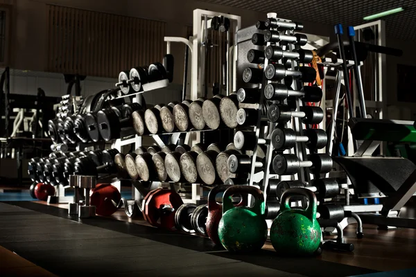
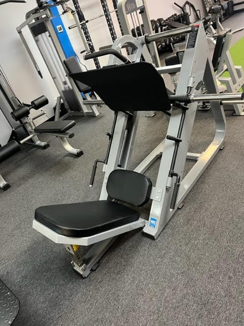
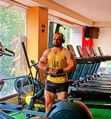
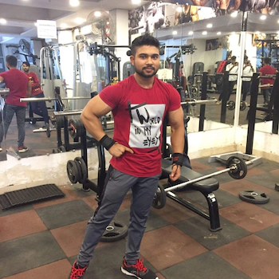
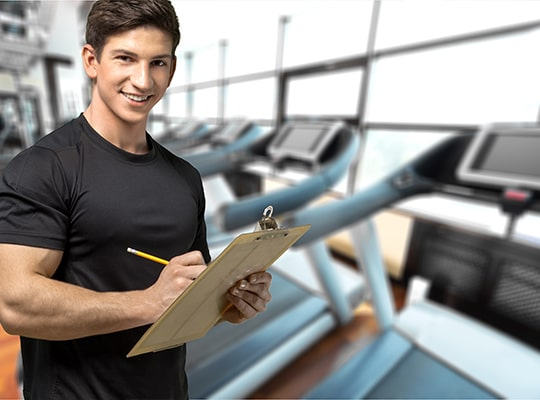
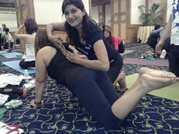

<!DOCTYPE html>
<html lang="en">
<head>
    <meta charset="UTF-8">
    <meta name="viewport" content="width=device-width, initial-scale=1.0">
    <title>THE Gym</title>
    
</head>
<body>

<header>
    
    <h1>"POWER FITNESS"</h1>
</header>

<nav>
    <a href="#home">Home.</a>
    <a href="#about">About Us.</a>
    <a href="#machines">Machines.</a>
    <a href="#trainers">Trainers.</a>
    <a href="#membership">Monthly Plan.</a>
    <a href="#contact">Contact.</a>
</nav>

<section id="home" class="hero">
    

        <h1>Welcome to "POWER FITNESS"</h1>
        
Your journey to fitness starts here!

    

</section>

<section id="about" class="content" align="left">
    <h2>About Us</h2>
    
"POWER FITNESS" is dedicated to helping you achieve your fitness goals with top-class equipment, certified trainers, and a variety of fitness programs.

</section>

<section id="machines" class="gym-machines">
    <h2>Our Gym Machines</h2>
    

        

            
            
Treadmill

        

        

            
            
Weights

        

        

            
            
Elliptical

        

        

            
            
Bench Press

        

        

            
            
Leg Press

        

    

</section>

<section id="trainers" class="content">
    <h2>Meet Our Trainers</h2>
    

        
        
<strong>Sandip:</strong> Strength training expert with 5 years of experience.

    

    

        
        
<strong>Kuldip:</strong> Cardio and endurance specialist, ensures you're always pushing your limits.

    

    

        
        
<strong>Anish:</strong> HIIT and flexibility trainer, helps you gain agility and power.

    

    

        
        
<strong>Pooja:</strong> Yoga and Pilates expert, creating balance between mind and body.

    

    
</section>

<section id="attitude" class="attitude">
    <h2>Motivated Snowgen</h2>
    
"Leave your excuses at the door, because at "POWER FITNESS", we turn sweat into success."

    
"Train insane or remain the same."

        
"Your fitness is 100% mental. Your body won’t go where your mind doesn’t push it."

</section>

<section id="membership" class="membership" align="center">
    <h2>Membership Plans</h2>
    <table>
        <tr>
            <td>Plan</td>
            <td>Duration</td>
            <td>Price</td>
            <td>Feature</td>
        </tr>
        <tr>
            <td>Basic</td>
            <td>1 Month</td>
            <td>800₹</td>
            <td>Full access to gym equipment
1 group fitness class per week
Locker access
General fitness consultation
Flexible gym timings (limited to non-peak hours)
No personal trainer or advanced amenities</td>
        </tr>
        <tr>
            <td>Standard</td>
            <td>3 Months</td>
            <td>2300₹</td>
            <td>All Basic Plan features
3 group fitness classes per week
Access to more advanced machines (e.g., HIIT, resistance machines)
1 personalized fitness consultation per month
Priority access during non-peak hours
Complimentary towel service</td>
        </tr>
        <tr>
            <td>Premium</td>
            <td>6 Months</td>
            <td>4500₹</td>
            <td>All Standard Plan features
Unlimited group fitness classes
1 personal trainer session per month
Customized fitness and nutrition plan
Access to steam room, sauna, and premium machines
2 guest passes per month for friends or family
Free Wi-Fi access in the gym</td>
        </tr>
        <tr>
            <td>VIP</td>
            <td>1 Years</td>
            <td>8500₹</td>
            <td>All Premium Plan features
Unlimited personal trainer sessions
Personalized fitness coaching (workout + diet plan)
Exclusive access to VIP locker rooms and showers
Complimentary sports drinks and protein shakes
Monthly fitness assessments (BMI, muscle mass, etc.)
Priority registration for new classes and gym events
Access to VIP lounge and reserved parking
Complimentary gym apparel kit (shirts, bottles, etc.)</td>
        </tr>
    </table>
</section>

<section id="testimonials" class="testimonials">
    <h2>What Our Members Say</h2>
    
"Joining "POWER FITNESS" was the best decision I made for my health. The trainers are amazing, and the machines are top-notch!" - Sarah M.

    
"I've never felt more energized and motivated. The atmosphere at "POWER FITNESS" pushes you to do your best." - John D.

    
"The yoga classes have really helped me achieve balance in my life, both physically and mentally." - Priya S.

</section>

<section id="contact" class="content">
    <h2>Contact Us</h2>
    <form action="submit_form.php" method="post">
        <table>
            <tr>
                <td><label for="name">Name:</label></td>
                <td><input type="text" id="name" name="name" placeholder="Your full name" required></td>
            </tr>
            <tr>
                <td><label for="email">Email:</label></td>
                <td><input type="email" id="email" name="email" placeholder="Your email" required></td>
            </tr>
            <tr>
                <td><label for="phone">Phone:</label></td>
                <td><input type="tel" id="phone" name="phone" placeholder="Your phone number"></td>
            </tr>
            <tr>
                <td><label for="plan">Membership Plan:</label></td>
                <td>
                    <select id="plan" name="plan">
                        <option value="basic">Basic (1 Month)</option>
                        <option value="standard">Standard (3 Months)</option>
                        <option value="premium">Premium (6 Months)</option>
                        <option value="vip">VIP (1 Years)</option>
                    </select>
                </td>
            </tr>
            <tr>
                <td><label for="message">Message:</label></td>
                <td><textarea id="message" name="message" placeholder="Any questions or comments"></textarea></td>
            </tr>
            <tr>
                <td colspan="2" align="center">
                    <input type="submit" class="submit-btn" value="Submit">
                </td>
            </tr>
        </table>
    </form>
</section>

<footer class="footer">
    
&copy; 2024 "POWER FITNESS". All rights reserved.

</footer>

</body>
</html>
